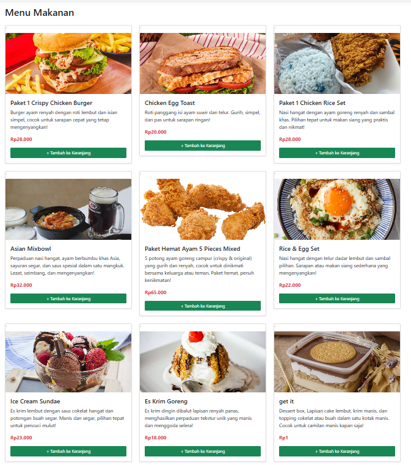
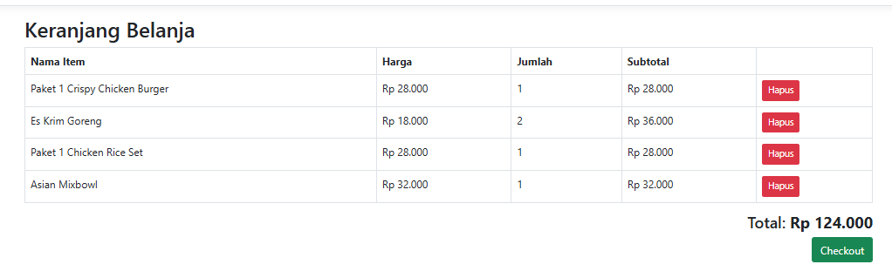
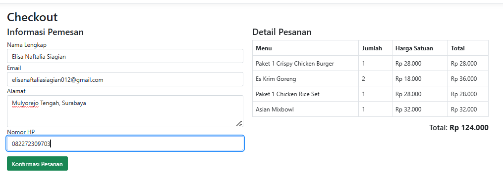
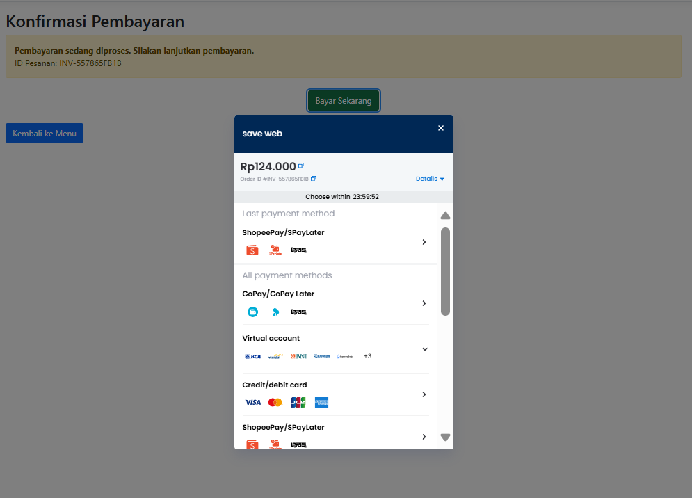
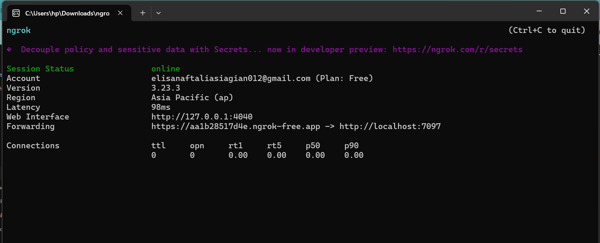

# 🛒 FastFood.web – E-Commerce ASP.NET Core + Midtrans

**FastFood.web** adalah aplikasi e-commerce sederhana berbasis ASP.NET Core MVC. Aplikasi ini memungkinkan pengguna untuk:

- Melihat daftar produk makanan
- Menambahkan produk ke keranjang
- Melakukan checkout dengan formulir data pengguna
- Menyelesaikan pembayaran melalui Midtrans Snap (Sandbox Mode)
- Menerima update notifikasi status pembayaran dari Midtrans melalui webhook
- (Opsional) Menampilkan riwayat transaksi pengguna

---

## 🚀 Fitur Utama

✅ Melihat daftar produk makanan  
✅ Menambahkan produk ke keranjang belanja  
✅ Checkout dengan nama, email, nomor HP, dan alamat  
✅ Pembayaran melalui Midtrans Snap (sandbox)  
✅ Webhook notifikasi status pembayaran  
✅ (Opsional) Riwayat transaksi berdasarkan email  

---

## 🧱 Teknologi

- **ASP.NET Core MVC**
- **Entity Framework Core** + **SQL Server**
- **Midtrans Snap API (Sandbox Mode)**
- **Bootstrap 5** (UI)
- **Ngrok** (untuk testing webhook Midtrans)

---

## 🧑‍💻 Alur Pengguna (User Flow)

1. Pengguna membuka halaman utama dan melihat daftar produk
2. Pengguna klik “Tambah ke Keranjang”
3. Pengguna membuka halaman keranjang dan klik “Checkout”
4. Pengguna mengisi form checkout (nama, email, nomor HP, alamat)
5. Klik tombol **“Bayar Sekarang”** → Midtrans Snap terbuka
6. Setelah transaksi selesai, pengguna diarahkan ke halaman **konfirmasi status**
7. Webhook Midtrans mengirim notifikasi ke backend → status pesanan diperbarui

---

## 🗂️ Struktur Proyek

```
FastFood.web/
├── Areas/
│   ├── Admin/
│   └── Customer/
│       ├── Controllers/
│       └── Views/
│           └── Home/
│               ├── Index.cshtml
│               ├── Cart.cshtml
│               ├── Checkout.cshtml
│               └── OrderConfirmation.cshtml
├── Controllers/
│   └── API/
│       └── PaymentController.cs
├── Models/
│   ├── Item.cs
│   ├── OrderHeader.cs
│   ├── OrderDetail.cs
│   └── ViewModels/
│       ├── CartViewModel.cs
│       └── OrderViewModel.cs
├── Data/
│   └── ApplicationDbContext.cs
├── appsettings.json
├── Program.cs / Startup.cs
└── wwwroot/
```

---

## 🔐 Integrasi Midtrans

Konfigurasi Midtrans dilakukan melalui `appsettings.json`:

```json
"Midtrans": {
  "ServerKey": "Mid-server-xxxxxxxx",
  "ClientKey": "Mid-client-xxxxxxxx",
  "IsProduction": false
}
```

### API Endpoint:

| Endpoint                        | Fungsi                                 |
|--------------------------------|----------------------------------------|
| `POST /api/payment/token`      | Generate Snap Token                    |
| `POST /api/payment/notification`| Menerima notifikasi status pembayaran |

> Gunakan `ngrok` untuk expose localhost agar dapat menerima notifikasi webhook.

---

## 🧪 Langkah Menjalankan Aplikasi

1. **Clone repository**:
   ```bash
   git clone https://github.com/namakamu/fastfood-web.git
   ```

2. **Edit konfigurasi database** di `appsettings.json`

3. **Apply migration**:
   ```bash
   dotnet ef database update
   ```

4. **Jalankan aplikasi**:
   ```bash
   dotnet run
   ```

5. **Aktifkan webhook Midtrans:**

   - Jalankan `ngrok`:
     ```bash
     ngrok http https://localhost:5001
     ```
   - Salin URL (misal: `https://1234.ngrok-free.app`)
   - Tambahkan ke dashboard Midtrans → Setting → Configuration → "Notification URL":
     ```
     https://1234.ngrok-free.app/api/payment/notification
     ```

---

## 📑 Endpoint Penting

| Method | Endpoint                            | Fungsi                          |
|--------|-------------------------------------|---------------------------------|
| GET    | /Customer/Home/Index                | Menampilkan produk              |
| POST   | /Customer/Home/AddToCart            | Menambah ke keranjang           |
| GET    | /Customer/Home/Cart                 | Melihat keranjang               |
| POST   | /Customer/Home/CheckoutConfirmed    | Menyimpan pesanan & ambil token |
| POST   | /api/payment/token                  | Generate Snap Token             |
| POST   | /api/payment/notification           | Menerima notifikasi pembayaran  |

---

## 🖼️ Screenshots

### 🧁 Halaman Daftar Menu Makanan


### 🛒 Halaman Keranjang


### 📋 Halaman Checkout


### 💳 Snap Midtrans


### 🔔 Webhook Midtrans (Ngrok)


---

## 🙋 FAQ

**Q: Apakah Snap berjalan otomatis di local?**  
A: Ya, selama ClientKey benar dan tidak ada error jaringan. Gunakan HTTPS dan jangan lupa disable browser blocker jika Snap tidak muncul.

**Q: Kenapa status tidak update?**  
A: Pastikan webhook Midtrans sudah mengarah ke URL `ngrok`, dan `IsProduction` di set ke `false`.

---

## 👤 Author

Dibuat oleh **Elisa Naftalia Siagian**  
📧 Email Penugasan: [dimas.afrilliyan@biru.web.id](mailto:dimas.afrilliyan@biru.web.id)  
📁 Digunakan untuk tes programmer 

---

